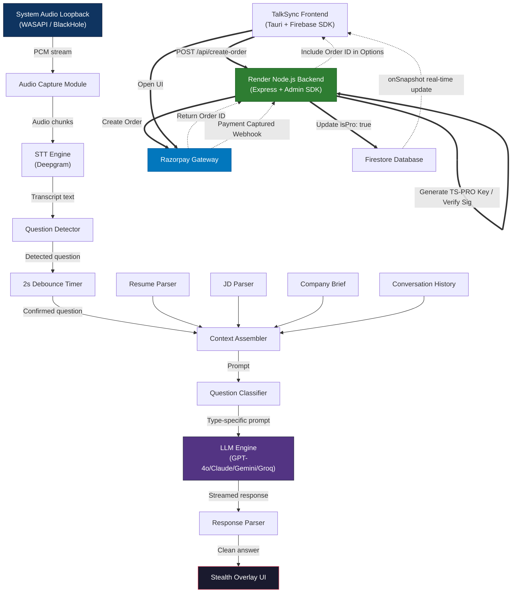
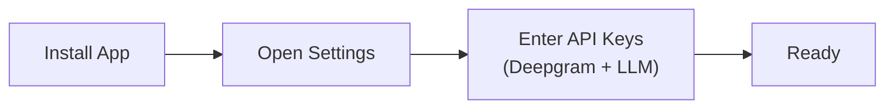
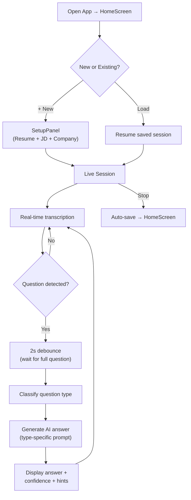
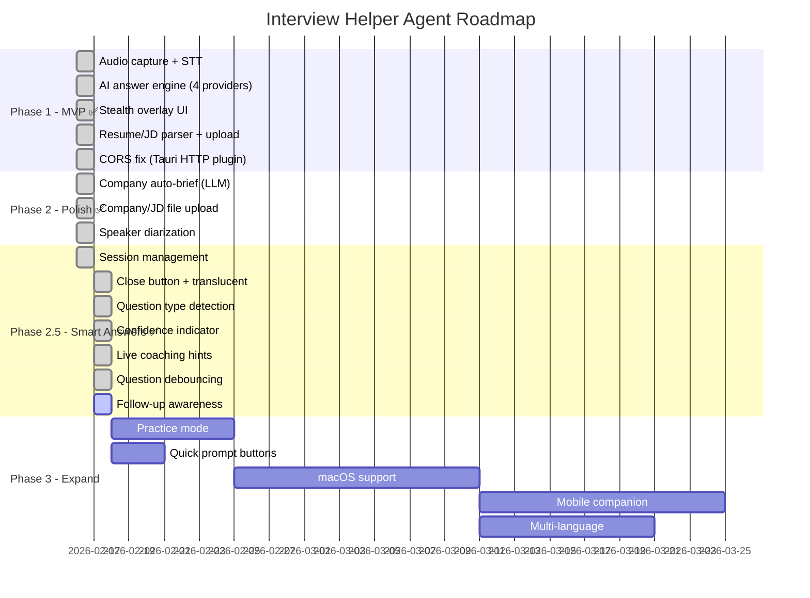

# TalkSync — Product Requirements Document (PRD)

**Version:** 2.5  
**Date:** 2026-02-22  
**Author:** Raj / AI Assistant  
**Status:** Active

---

## 1. Product Vision

TalkSync is an AI-powered desktop assistant designed to provide real-time, context-aware interview support. It captures audio from interviews, transcribes it locally or via API, and generates relevant answers using Large Language Models (LLMs) based on the user's resume and job description. The application operates discreetly as a transparent overlay, ensuring the user maintains eye contact and confidence during the interview process.

---

## 2. Problem Statement

| Pain Point | Detail |
|---|---|
| **Interview anxiety** | Candidates freeze or give incomplete answers under pressure |
| **JD alignment** | Hard to recall how your experience maps to every JD requirement |
| **Company context** | Forgetting company-specific talking points mid-interview |
| **Time pressure** | Behavioral and technical questions demand structured answers fast |
| **Generic AI answers** | Standard AI gives robotic, bullet-pointed answers that don't sound human |

---

## 3. Target Users

- Job seekers preparing for and attending remote video interviews
- Career switchers who need help articulating transferable skills
- Non-native English speakers who want polished, natural phrasing
- Freelancers / contractors interviewing for multiple roles simultaneously

---

## 4. Core Features

### 4.1 Real-Time System Audio Capture

The app captures **system audio** (not the microphone) — meaning it hears exactly what comes through the user's speakers/headphones, including the interviewer's voice from Zoom, Google Meet, or Teams.

| Requirement | Details |
|---|---|
| **Audio source** | System audio loopback (not mic) — captures interviewer's voice from Zoom, Meet, Teams, etc. |
| **Method** | Windows WASAPI loopback — hooks into the default audio output device at the OS level |
| **macOS alternative** | BlackHole / Soundflower virtual audio cable (future) |
| **Latency target** | < 300 ms from speech to audio chunks being sent to STT |
| **Platform support** | Windows 10/11 (primary), macOS (secondary, planned) |
| **No mic required** | User doesn't need to share their mic — the app only listens to the interviewer's audio |

> [!TIP]
> Because we capture system audio (not mic), there's zero feedback loop or echo. The interviewer's voice goes directly to the STT engine without any of the candidate's speech interfering.

---

### 4.2 Real-Time Speech-to-Text (STT)

Audio chunks are streamed to Deepgram's WebSocket API for real-time transcription with speaker diarization.

| Requirement | Details |
|---|---|
| **Engine** | Deepgram Streaming API — WebSocket-based, real-time |
| **Accuracy** | ≥ 95% word accuracy on English conversational speech |
| **Speaker diarization** | Distinguishes interviewer (Speaker 0) from candidate (Speaker 1) — only interviewer speech triggers answer generation |
| **Streaming model** | `nova-2` — Deepgram's latest, optimized for conversation |
| **Punctuation** | Automatic punctuation and capitalization |
| **Interim results** | Shows partial transcripts as the person speaks, finalized when sentence completes |

**How diarization works:** The first speaker detected is labeled as Speaker 0 (interviewer). In the transcript panel, interviewer lines appear on the left and candidate lines on the right — making it easy to follow the conversation flow.

---

### 4.3 AI Answer Generation

When a question is detected, the app sends the full context (resume + JD + company + conversation history + question) to the configured LLM and streams the answer token by token.

| Requirement | Details |
|---|---|
| **LLM backend** | OpenAI GPT-4o, Anthropic Claude, Google Gemini, Groq — user picks in Settings |
| **Context window** | Resume + JD + Company brief + conversation history + detected question |
| **Answer style** | Conversational first-person — adapts format based on question type (§4.8) |
| **Response time** | 3–5 seconds (GPT-4o/Claude), ~1–2 seconds (Groq — ultra-fast inference) |
| **Streaming** | Token-by-token display — candidate can start reading while the rest generates |
| **Structured output** | Each response contains: `[CONFIDENCE:level]` tag + main answer + `[HINTS]` section |
| **Max tokens** | 800 tokens (~300 words) — enough for a detailed answer + hints |
| **Temperature** | 0.7 — balanced between creativity and consistency |

**Provider comparison:**

| Provider | Speed | Quality | Best For |
|---|---|---|---|
| **Groq** | ⚡ ~1s | Good | Ultra-fast responses, real-time feel |
| **OpenAI GPT-4o** | ~3s | Excellent | Best overall answer quality |
| **Anthropic Claude** | ~3s | Excellent | Natural, thoughtful responses |
| **Google Gemini** | ~2s | Very Good | Good balance of speed + quality |

---

### 4.4 Context Management

The app assembles a rich context from multiple sources to generate relevant, personalized answers.

| Input | How it's provided | How it's used |
|---|---|
| **Resume** | Upload PDF/DOCX or paste text | Primary source — project names, companies, technologies, and metrics are pulled directly into answers |
| **Job Description** | Upload PDF/DOCX/TXT or paste text | Aligns answers to the specific role requirements — emphasizes relevant skills |
| **Company brief** | Three options: (1) Auto-fetch by typing company name — LLM generates a research brief, (2) Upload document, (3) Paste manually | Weaves in company-specific context — culture, products, recent news |
| **Conversation history** | Automatic — rolling window of recent transcript | Maintains context across follow-up questions — prevents contradictions and repetition |

**Auto-fetch example:** Type "Google" → the app calls the LLM to generate a brief covering Google's mission, culture, products, recent news, and interview style. This brief is then used as context for all answers in the session.

---

### 4.5 Stealth / Invisibility Mode

> [!CAUTION]
> This is the most critical differentiator — the app **must not** be visible during screen-sharing.

The app is designed to be **completely invisible** during screen sharing on Zoom, Meet, and Teams.

| Technique | Details |
|---|---|
| **Windows capture exclusion** | Uses `SetWindowDisplayAffinity(WDA_EXCLUDEFROMCAPTURE)` — the OS itself hides the window from all screen capture APIs, screenshots, and recording software |
| **No taskbar icon** | `skipTaskbar: true` — the app doesn't appear in the Windows taskbar or Alt-Tab switcher |
| **No console window** | `#![windows_subsystem = "windows"]` in Rust — suppresses the terminal window even in debug builds |
| **Hotkey toggle** | `Ctrl+Shift+I` — instantly show/hide the overlay without touching the mouse |
| **Always-on-top** | Window floats above all other windows so it's always readable during the interview |
| **Semi-transparent** | Translucent background so the interviewer's video call is partially visible behind the app |

**What the interviewer sees on screen share:** Nothing. The window is completely excluded from the capture pipeline at the OS level. It's not a CSS trick — it's a native Windows API call.

---

### 4.6 Answer Display UI (Overlay)

The app's UI is a compact floating panel designed for quick glancing during a conversation.

| Element | Details |
|---|---|
| **Layout** | Compact floating panel (≈ 400×500 px), frosted glass dark background |
| **Top section** | Live transcript — color-coded by speaker (interviewer = left, candidate = right) |
| **Main section** | Suggested answer — streams in real-time with animated generating indicator (● ● ●) |
| **Question display** | Shows detected question with question type badge (📖 Behavioral / ⚙️ Technical / etc.) |
| **Confidence badge** | Colored indicator (🟢 High / 🟡 Medium / 🔴 Low) in the answer header |
| **Coaching hints** | Collapsible "📌 Coaching Hints" section with 3-4 key talking points from the resume |
| **Copy button** | 📋 One-click copy of the full answer text |
| **Auto-scroll** | Both transcript and answer panels auto-scroll to latest content |
| **Drag region** | Top bar — click and drag to reposition the window anywhere |
| **Close button** | `×` button in corner with `stopPropagation` to prevent drag interference |

---

### 4.7 Session Management & Data Persistence

The app supports multiple interview sessions with robust file-based data persistence. All data is stored as JSON files in the OS app data directory (`%APPDATA%/com.raj.talksync/` on Windows) using the Tauri FS plugin — **not** browser localStorage.

| Feature | Details |
|---|---|
| **Home screen** | Landing page showing all previous sessions as cards with company name, role, and date |
| **New session** | Click "+" to create a new session — enters Setup panel for resume/JD/company input |
| **Load session** | Click any session card to resume with all saved context (resume, JD, company brief) |
| **Delete session** | Remove old sessions you no longer need |
| **Global settings** | API keys (Deepgram, LLM provider, API key, model) stored in `settings.json` — configure once, use across all sessions |
| **Auto-save** | When you stop a session, the transcript and all generated Q&A pairs are automatically saved to individual session files |
| **File-based storage** | Each session stored as a separate `<uuid>.json` file under `sessions/` — no size limits, survives cache clears |
| **Migration** | First launch automatically migrates any old localStorage data to the new file-based format |
| **Backup & restore** | Users can back up by copying the `com.raj.talksync` folder from `%APPDATA%` |

**User flow:**
```
Launch App → Home Screen (session list)
  ├── ⚙️ Settings → Configure API keys
  ├── ➕ New Session → Setup (resume + JD + company) → Live Session
  └── 📂 Load Session → Live Session (with saved context)
```

### 4.8 Freemium Monetization & Authentication

TalkSync features a strict Freemium paywall governed by a standalone backend server and Firebase infrastructure.

| Feature | Details |
|---|---|
| **Authentication** | Users must log in via Email/Password or Google OAuth (Tauri plugin) to use the app. |
| **Free Tier Limits** | Free users can create a maximum of exactly **5 interview sessions**. |
| **Paywall Lockout** | Upon attempting to create a 6th session, the New Session button disables and alerts the user to upgrade to PRO. |
| **Razorpay Checkout** | Users can tap "Purchase Pro" in settings to invoke the Razorpay SDK popup inside the Tauri app window. |
| **Manual Verification** | If a user purchases on a different device, they can paste their `TS-PRO-XYZ` license key into Settings to instantly unlock PRO features. |
| **Real-time Activation** | Firestore `onSnapshot` listeners instantly update the UI from FREE to PRO the millisecond the webhook hits the database, requiring zero app reloads. |
| **Backend Keep-Alive** | The Render Free Tier backend is kept continuously awake via a completely free UptimeRobot 10-minute HTTP ping to the `/health` endpoint. This guarantees instant 0-second Razorpay checkout loads for users. |

---

### 4.9 Smart Answer Intelligence

This is the AI quality engine — it ensures every answer sounds like a real human speaking naturally, with relevant resume-backed content.

#### 4.8.1 Question Type Detection

When the interviewer asks a question, it's automatically classified into one of 5 types using ~50 regex patterns:

| Type | Badge | Example Triggers | Result |
|---|---|---|---|
| **Behavioral** | 📖 | "Tell me about a time you led a team", "Give an example of a challenge" | STAR storytelling with specific numbers |
| **Technical** | ⚙️ | "How would you design microservices?", "Explain REST APIs" | Step-by-step whiteboard-style explanation |
| **Personal** | 💭 | "Tell me about yourself", "Why this role?", "What motivates you?" | Warm, authentic, genuine tone |
| **Situational** | 🎯 | "What would you do if a deadline was missed?", "How would you handle..." | Structured problem-solving approach |
| **General** | 💬 | Anything that doesn't match the above patterns | Direct, concise, under 30 seconds |

**Priority order:** Behavioral → Personal → Situational → Technical → General. This prevents misclassification — e.g., "Tell me about a time you debugged a production issue" is classified as **Behavioral** (not Technical) because STAR storytelling is the appropriate format.

#### 4.8.2 Per-Type Smart System Prompt

Each question type sends **completely different instructions** to the LLM:

| Type | What the LLM is told to do |
|---|---|
| **Behavioral** | *"Use STAR method conversationally — weave Situation → Task → Action → Result into a natural story. Set the scene briefly, then focus on YOUR actions and outcome. Include specific numbers: team size, timeline, percentage improvement."* **(New: Uses 'PPC' framework for challenges)** |
| **Technical** | *"Explain step-by-step like you're whiteboarding with a colleague. Start with high-level approach, then dive into specifics. Mention actual technologies from the resume. Address trade-offs briefly."* |
| **Personal** | *"Be warm, authentic, and genuine. Connect to real career experiences. Show self-awareness. Tie motivations back to the role. Sound passionate but grounded, not rehearsed."* **(New: Enforces 'Professional Journey' structure)** |
| **Situational** | *"Show structured thinking while staying conversational. Acknowledge the scenario, outline your approach step by step. Draw parallels to similar real situations you've handled."* |
| **General** | *"Direct and concise — get to the point fast. Answer the specific question without over-explaining. Keep it under 30 seconds of speaking time."* **(New: Triggers 'Reverse Interview' questions)** |

**Base prompt rules (applied to ALL types):**
- Sound like a real human — use transitions like "So what happened was...", "Honestly, the biggest win was..."
- Vary sentence length — mix short punchy lines with longer explanations
- **NEVER** use bullet points or numbered lists — speak in flowing paragraphs
- Reference **specific details** from resume: project names, company names, technologies, team sizes, metrics
- Keep answers 60-90 seconds of speaking time (~150-200 words)
- End with a concrete result, impact, or takeaway

#### 4.8.3 Confidence Indicator

The LLM self-reports how confident it is based on how well the candidate's resume matches the question:

| Level | Badge | When It Appears | What It Means |
|---|---|---|---|
| 🟢 **High** | Green border | Resume + JD strongly match the question; the LLM found specific projects and metrics to reference | **Trust the answer** — it's grounded in your real experience |
| 🟡 **Medium** | Yellow border | Partial match — the resume has related experience but not a perfect fit | **Use as a starting point** — adapt and personalize while speaking |
| 🔴 **Low** | Red border | The question falls outside the resume scope; the answer is generic/hypothetical | **Wing it yourself** — rely on your own knowledge |

**How it works:** The LLM is instructed to prepend `[CONFIDENCE:high|medium|low]` to its response. The app parses this tag from the streamed response and displays it as a colored badge — the tag itself is stripped from the displayed answer.

#### 4.8.4 Live Coaching Hints

Below each answer, a **collapsible section** shows 3-4 key talking points extracted from the resume.

**Example output:**
```
📌 Mention: AWS migration project → 40% cost reduction over 6 months
📌 Led cross-functional team of 8 engineers
📌 Used Terraform + GitHub Actions CI/CD for infrastructure automation
📌 Resulted in 99.9% uptime SLA achievement
```

**Why this matters:** Instead of reading a full scripted answer (which sounds robotic), the candidate glances at 3-4 bullet points and weaves them into their own speaking style — resulting in a much more natural-sounding response.

**How it works:** The LLM appends a `[HINTS]` section after the main answer. The app parses and strips this into a separate collapsible UI section with 📌 icons.

---

### 4.9 UI Polish & Interaction

#### Quick Action Buttons
Inside the answer panel, three quick-action buttons allow instantaneous rewriting of the suggested answer:
- **Make Shorter:** Condenses the answer to <45 seconds.
- **Add Example:** Injects a concrete STAR example from the resume.
- **Deep Dive:** Expands on technical details and trade-offs.

#### Close Button
Since the app uses a frameless window (no native title bar), a custom `×` button sits in the top-right corner. It uses `stopPropagation` on mouseDown to prevent the drag region from intercepting the click. Calls `appWindow.destroy()` for immediate termination.

#### Translucent / Glassmorphism UI
Semi-transparent backgrounds with backdrop blur create a frosted glass effect:
- **Setup mode:** `rgba(10, 10, 26, 0.75)` + `blur(24px)`
- **Session mode:** `rgba(10, 10, 26, 0.7)` + `blur(20px)`
- Desktop wallpaper/other windows bleed through slightly, giving a modern premium feel

#### Custom Window Dragging
32px drag region at the top of each screen with `grab/grabbing` cursor. Uses native `-webkit-app-region: drag` for smooth, OS-level drag behavior.

#### Adjustable Opacity
Slider in Settings to control window transparency (10% to 100%).
- **Default:** 70% opacity usually works best.
- **Implementation:** Applies dynamic `background: rgba(10, 10, 26, {opacity})` to the window container.

---

### 4.10 Intelligent Question Debouncing

A 2-second debounce prevents premature answer generation when the interviewer pauses mid-question.

| Scenario | Behavior |
|---|---|
| Interviewer says "Tell me about..." then pauses | Timer starts (2 seconds) |
| Interviewer continues "...a time when you led a team" | Timer **resets** (2 seconds) |
| 2 seconds of silence after "led a team" | ✅ Answer generation triggers with the **full** question |
| Interviewer starts a completely new question | Previous timer cancelled, new timer starts |

**Without debounce:** The app would generate an irrelevant answer for "Tell me about" — a half-formed question.  
**With debounce:** The app waits for the interviewer to finish speaking, then generates an answer for the complete, fully-formed question.

---

### 4.11 Follow-Up Awareness

When the interviewer asks a follow-up like "Can you elaborate on that?" or "Tell me more", the app detects this and sends the **previous AI-generated answer** as additional context — so the LLM expands on what it already said instead of generating a disconnected fresh answer.

#### How It Works

1.  **Detection:** ~15 regex patterns identify follow-up questions:
    - "Can you elaborate", "Tell me more", "Go deeper", "Expand on that"
    - "Could you give more detail", "What do you mean by that"
    - "And then what happened", "How exactly", "More specifically"
    - Short questions under 8 words with "?" (e.g., "Really?", "How so?")

2.  **Context injection:** When a follow-up is detected, the previous Q&A pair is injected into the LLM prompt:
    ```
    ## PREVIOUS Q&A (they're asking you to elaborate on THIS)
    Q: "Tell me about a time you led a team"
    A: "At my previous company, I led a team of 8 engineers..."
    ```

3.  **LLM instructions:** The LLM is told: *"The interviewer is following up on your previous answer. Expand with new depth, additional examples, or more specifics. Do NOT repeat the same answer."*

#### Follow-Up vs. New Question

| Interviewer Says | Detection | Behavior |
|---|---|---|
| "Can you elaborate on that?" | ✅ Follow-up | Expands on previous answer with new details |
| "Tell me more about the AWS migration" | ✅ Follow-up | Adds depth to the specific topic |
| "How so?" | ✅ Follow-up (short + "?") | Brief expansion on the last point |
| "Now tell me about your leadership style" | ❌ New question | Fresh answer, no previous context |
| "What's your experience with Python?" | ❌ New question | Fresh answer on a new topic |

#### Session Isolation

> [!IMPORTANT]
> Follow-up context is **strictly session-scoped**. The previous Q&A is tracked inside the `useLLM` React hook, which resets when the session changes. There is zero cross-session data leakage.

#### UI Indicator

When a follow-up is detected, a **"↩️ Follow-up"** badge appears next to the question type badge, signaling to the candidate that the answer builds on the previous response.

---

### 4.12 Advanced Interview Techniques

The app now incorporates expert interview strategies derived from top career coaches (e.g., Diksha Arora) to make answers more persuasive and strategic.

#### 1. Strategic Honesty (Weaknesses)
- **Problem:** Standard AI answers often give generic "perfectionist" weaknesses or damaging admissions.
- **Solution:** The AI is strictly instructed to pair every weakness with a **mitigation system**.
- **Example:** *"I sometimes struggle with time management"* → *"I sometimes lose track of time when deep in code, so I now use Pomodoro timers and structured calendar blocks to stay on track."*

#### 2. Professional Journey (Tell Me About Yourself)
- **Problem:** Candidates (and AI) often ramble about childhood or hobbies.
- **Solution:** Enforced structure: [Past Experience] → [Key Skills/Wins] → [Why This Role].
- **Result:** A tight, 60-second elevator pitch focused purely on professional fit.

#### 3. Reverse Interviewing (Questions for the Recruiter)
- **Feature:** When the interviewer asks "Do you have any questions?", the AI **stops** generating standard answers and instead suggests **high-impact questions** to ask back.
- **Question Bank:**
    - *"What does success look like in the first 30-60 days?"*
    - *"What are the biggest challenges the team is facing?"*
    - *"How does this role contribute to the company's long-term goals?"*
- **Why:** This shifts the dynamic, showing the candidate is strategic and evaluating the company, not just desperate for a job.

#### 4. The "PPC" Framework
- **Used for:** "Tell me about a time you missed a deadline" or "handled a challenge".
- **Structure:** **P**lanning (how you analyzed it) → **P**rioritization (what you focused on) → **C**ommunication (how you kept stakeholders updated).

- **Structure:** **P**lanning (how you analyzed it) → **P**rioritization (what you focused on) → **C**ommunication (how you kept stakeholders updated).

---

### 4.13 Resume Gap Analysis (Pre-Flight Check)

A static analysis tool that runs *before* the interview starts to prepare the candidate for potential curveballs.

| Feature | Details |
|---|---|
| **Trigger** | Runs automatically when both Resume + JD are uploaded in Setup |
| **Output** | A structured report shown in the Setup panel: <br>1. **Match Score:** 0-100% based on keyword/skill overlap<br>2. **Missing Skills:** Key requirements in JD *not* found in Resume<br>3. **Predicted Questions:** 3 likely interview questions based on the gaps |
| **Goal** | "Forewarned is forearmed" — tells the user *exactly* where they are weak so they can prepare specific anecdotes. |

---

### 4.14 Interactive Practice Mode (Mock Interview Simulator)

An interactive mode where the user speaks their answers, and the AI provides real-time feedback.

| Feature | Details |
|---|---|
| **Entry Point** | "Practice Interview" button in Setup Panel. |
| **Flow** | 1. AI generates a question.<br>2. User clicks **Record** and speaks.<br>3. **Web Speech API** transcribes in real-time.<br>4. User clicks **Done** (or Stop).<br>5. AI analyzes the transcript and provides a **Score**, **Strengths**, and **Improvements**.<br>6. Validates against "Strategic Honesty" etc. |
| **Session Report** | At the end, summary stats: Avg Score, Weakest Area, Best Answer. |
| **Goal** | Simulate real pressure and validate if the user is applying the AI's coaching rules. |


---

## 5. Technical Architecture



### 5.1 Tech Stack

| Layer | Technology |
|---|---|
| **Desktop shell** | **Tauri 2.0** (lightweight, Rust-based) — ~10 MB binary, low RAM footprint |
| **Frontend (overlay)** | React 19 + TypeScript + CSS |
| **Monetization Backend** | **Node.js + Express** hosted on Render (Free Tier) |
| **Authentication/DB** | **Firebase** Auth & Firestore (Web SDK on frontend, Admin SDK on backend) |
| **Payment Gateway** | **Razorpay** SDK + Node.js Webhooks |
| **Audio capture** | Rust WASAPI loopback (Windows) |
| **STT** | Deepgram WebSocket API (cloud) |
| **LLM** | OpenAI / Anthropic / Google Gemini / Groq API via REST streaming |
| **HTTP networking** | `@tauri-apps/plugin-http` — routes all API calls through Rust backend, bypassing CORS |
| **Resume parsing** | `pdfjs-dist` (PDF), `mammoth` (DOCX) — in-browser parsing |
| **Data storage** | Tauri FS plugin — JSON files in `%APPDATA%/com.raj.talksync/` (settings.json + sessions/*.json) |
| **Question detection** | Regex-based classifier (~50 patterns across 5 types) |
| **Data storage** | Tauri FS plugin — JSON files in `%APPDATA%/com.raj.talksync/` (settings.json + sessions/*.json) |
| **Question detection** | Regex-based classifier (~50 patterns across 5 types) |
| **Response parsing** | Stream parser for `[CONFIDENCE:xxx]` and `[HINTS]` sections |
| **Practice Mode STT** | **Web Speech API** (Browser Native) — Zero-setup, online/offline (depends on OS), free. |

### 5.2 Key Technical Decisions

| Decision | Rationale |
|---|---|
| **Tauri over Electron** | ~10 MB vs ~150 MB binary, lower RAM, Rust backend for real-time audio |
| **Deepgram over Google STT** | Lower latency streaming, better punctuation, simpler WebSocket API |
| **Tauri HTTP plugin over fetch** | Browser `fetch()` from Tauri webview sends `Origin: tauri.localhost`, causing CORS rejections. Plugin routes through Rust — no CORS headers |
| **Window capture exclusion** | Native OS API is the only reliable stealth method; CSS tricks don't work |
| **Debounce over instant trigger** | 2-second debounce prevents generating answers for half-formed questions |
| **LLM-embedded confidence** | Having the LLM self-report confidence within the same response avoids a second API call |
| **Web Speech API for Practice** | Zero dependency, no heavy binaries to ship, "just works" for simple dictation. |

---

## 6. User Flows

### 6.1 First-Time Setup



### 6.2 Interview Session



---

## 7. Non-Functional Requirements

| Category | Requirement |
|---|---|
| **Latency** | End-to-end (speech → answer displayed) < **8 seconds** |
| **CPU usage** | < 10% during active session (no interference with video call) |
| **RAM** | < 300 MB resident memory |
| **Privacy** | All data stored locally on disk (`%APPDATA%/com.raj.talksync/`); audio never persisted; API calls use HTTPS |
| **Reliability** | Graceful degradation — if STT fails, show raw audio level; if LLM fails, show transcript only |
| **Accessibility** | Keyboard-navigable overlay; high-contrast mode |

---

## 8. Privacy & Ethics

> [!WARNING]
> This tool is designed as a **personal interview assistant**. Users should be aware of the ethical and legal implications.

| Consideration | Mitigation |
|---|---|
| **Recording consent** | App does NOT record or store audio — only processes in real-time |
| **Data privacy** | Resume and JD stored locally only; LLM API calls don't retain data (use zero-retention endpoints) |
| **Terms of service** | Disclaimers displayed at setup; user accepts responsibility |
| **Fair use** | Positioned as a "confidence booster" and "preparation aid," not a cheating tool |

---

## 9. Implementation Status

| Feature | Priority | Status |
|---|---|---|
| System audio capture (Windows WASAPI) | P0 | ✅ Done |
| Real-time STT via Deepgram | P0 | ✅ Done |
| Resume + JD context upload (PDF/DOCX/TXT) | P0 | ✅ Done |
| AI answer generation (GPT-4o / Claude / Gemini / Groq) | P0 | ✅ Done |
| Stealth overlay (capture-excluded window) | P0 | ✅ Done |
| Hotkey show/hide (`Ctrl+Shift+I`) | P0 | ✅ Done |
| Speaker diarization | P0 | ✅ Done |
| Company auto-brief (LLM-powered) | P1 | ✅ Done |
| Company doc upload (PDF/DOCX/TXT) | P1 | ✅ Done |
| Native HTTP (CORS bypass via Tauri plugin) | P0 | ✅ Done |
| Frameless window dragging | P0 | ✅ Done |
| No CMD window / taskbar stealth | P0 | ✅ Done |
| Session management (create/load/save/delete) | P1 | ✅ Done |
| Global settings (API keys, provider, model) | P1 | ✅ Done |
| Close button + translucent glassmorphism UI | P1 | ✅ Done |
| Question type detection (5 types, ~50 patterns) | P1 | ✅ Done |
| Per-type smart system prompt | P1 | ✅ Done |
| Confidence indicator (🟢🟡🔴) | P1 | ✅ Done |
| Live coaching hints (3-4 resume talking points) | P1 | ✅ Done |
| Intelligent question debouncing (2s) | P1 | ✅ Done |
| Follow-up awareness (elaborate/tell me more) | P1 | ✅ Done |
| **Advanced Techniques** (Corporate Strategy Rules) | P1 | ✅ Done |
| Follow-up awareness (elaborate/tell me more) | P1 | ✅ Done |
| **Advanced Techniques** (Corporate Strategy Rules) | P1 | ✅ Done |
| **Reverse Interviewing Logic** | P1 | ✅ Done |
| **Resume Gap Analysis** | P2 | ✅ Done |
| **Practice Mode** (Mock View) | P2 | 🚧 Planned |
| File-based data persistence (Tauri FS plugin) | P1 | ✅ Done |
| localStorage → file migration | P1 | ✅ Done |
| **Audit Improvements** | | |
| Global Error Boundary | P0 | ✅ Done |
| Deepgram Auto-Reconnect (Exponential Backoff) | P1 | ✅ Done |
| Production Console Cleanup | P1 | ✅ Done |

### 9.1 Monetization Infrastructure Status
| Feature | Priority | Status |
|---|---|---|
| User Authentication (Email/Google) | P0 | ✅ Done |
| Free tier limitation logic (5 sessions) | P0 | ✅ Done |
| Standalone Render backend API | P0 | ✅ Done |
| Razorpay Checkout UI Integration | P0 | ✅ Done |
| Razorpay Webhook Verification | P0 | ✅ Done |
| Real-time Firestore Sync | P0 | ✅ Done |
| Manual License Key Validation | P1 | ✅ Done |

> [!NOTE]
> **Scope:** Personal use tool. All interview types supported (behavioral, technical, personal, situational, general).
> **Offline mode trade-off:** Running locally (Whisper + Ollama) uses significantly more resources — **~4–6 GB extra RAM** and **20–40% CPU**. Cloud APIs are recommended for live interviews. Offline mode is a P2 option.

---

## 10. Roadmap



---

## 11. Success Metrics

| Metric | Target |
|---|---|
| Speech-to-answer latency | < 8 seconds (P95) |
| Answer relevance (user rating) | ≥ 4.2 / 5.0 |
| Stealth success rate | 100% — never visible during screen share |
| Session stability | Zero crashes in 1-hour interview |
| CPU overhead | < 10% on mid-range laptop |

---

## 12. Risks & Mitigations

| Risk | Impact | Likelihood | Mitigation |
|---|---|---|---|
| OS update breaks capture-exclusion API | High | Medium | Monitor OS changelogs; maintain fallback (secondary device mode) |
| STT accuracy drops on accented speech | Medium | High | Allow user to switch STT engine; fine-tune Whisper model |
| LLM generates hallucinated experience | High | Medium | Ground answers strictly in resume; confidence indicator warns when answer is generic |
| Interview platform detects audio capture | Medium | Low | Use OS-level loopback (not inject); no process hooking |
| High API costs for frequent users | Medium | High | Offer local Whisper + local LLM (Ollama) mode for $0 cost |
| Premature answer on partial questions | Medium | High | ✅ Solved — 2-second debounce waits for interviewer to finish speaking |

---

## 13. Decisions Made

| Question | Decision |
|---|---|
| **Desktop Shell:** Tauri (Rust + React) for a lightweight, secure, and native-feeling application.
*   **Frontend:** React (TypeScript) for a responsive and dynamic user interface.
*   **State Management:** React Context / Hooks for managing application state.
*   **Styling:** CSS Modules / Styled Components for modular and maintainable styles.
*   **Audio Capture:** Rust backend (cpal/rodio) or Web Audio API for capturing system/microphone audio.
*   **Speech-to-Text:** Deepgram API (primary) or local Whisper model (future) for transcription.
*   **LLM Integration:** OpenAI API (GPT-4o) and other providers for answer generation. |
| **Speaker diarization** | ✅ P0 — must distinguish interviewer from candidate |
| **Native HTTP over browser fetch** | ✅ Required — Tauri webview CORS blocks all LLM API calls |
| **Question debouncing** | ✅ 2-second delay — prevents generating answers for half-formed questions |
| **Confidence embedded in LLM response** | ✅ One API call for answer + confidence + hints — no extra latency |
